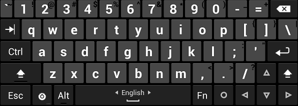

## Overview ##

Are you missing the key layout you're used to from your computer when using an Android device? This software keyboard has separate number keys, punctuation in the usual places, and arrow keys. It is based on the AOSP Gingerbread soft keyboard, so it supports multitouch for the modifier keys.

This keyboard is especially useful if you use ConnectBot for SSH access. It provides working Tab/Ctrl/Esc keys, and the arrow keys are essential for devices such as the Xoom tablet or Nexus S that don't have a trackball or D-Pad.

The supported keyboard layouts include Armenian (Հայերեն), Arabic (العربية),
British (en\_GB), Bulgarian (български език), Czech (Čeština), Danish (dansk),
Carpalx English (language "en-CX"), Dvorak English (language "en-DV"), English
(QWERTY), Finnish (Suomi), French (Français, AZERTY), German (Deutsch, QWERTZ),
German Neo2 (Deutsch, language "de-NE"),
Greek (ελληνικά), Hebrew (עברית), Hungarian (Magyar), Italian (Italiano), Lao
(ພາສາລາວ), Norwegian (Norsk bokmål), Persian (فارسی), Portuguese (Português),
Romanian (Română), Russian (Русский), Russian phonetic (Русский, ru-rPH),
Serbian (Српски), Slovak (Slovenčina), Slovenian
(Slovenščina)/Bosnian/Croatian/Latin Serbian, Spanish (Español, Español
Latinoamérica), Swedish (Svenska), Tamil (தமிழ்), Thai (ไทย), Turkish (Türkçe),
and Ukrainian (українська мова).

To install, get **[Hacker's
Keyboard](https://play.google.com/store/apps/details?id=org.pocketworkstation.pckeyboard)**
from the Play Store, plus optional [dictionary
packs](https://play.google.com/store/apps/developer?id=Klaus+Weidner).

## Additional resources ##

See the **[Release Notes](https://github.com/klausw/hackerskeyboard/wiki/ReleaseNotes)** for changes in the Play Store released versions.

Having problems? See the **[User's Guide](https://github.com/klausw/hackerskeyboard/wiki/UsersGuide)** and **[FAQ](https://github.com/klausw/hackerskeyboard/wiki/FrequentlyAskedQuestions)**, and check the [issue tracker](https://github.com/klausw/hackerskeyboard/issues) for known bugs or filing new ones.

Comments, requests, or contributions? Join the [discussion group](http://groups.google.com/group/hackerskeyboard/).

Application developers: see [the page about keyboard support in applications](https://github.com/klausw/hackerskeyboard/wiki/KeyboardSupportInApplications) if you want to enable the additional keys in your Android application, the same method also works for hardware USB or Bluetooth keyboards.

